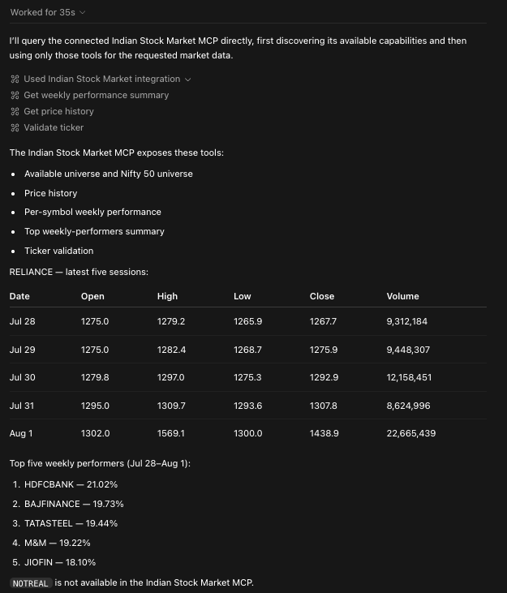

# Indian Stock Market MCP

A local, MCP-first server for Indian equity research with daily OHLCV data.
It works with Codex, Claude Code, Cursor, and other MCP-compatible clients.

The server does not call OpenAI or Anthropic APIs and does not require either
provider's API key. Your MCP client supplies the model; this project supplies
the market-data tools.

> [!WARNING]
> This is a research and demonstration tool, not investment advice. Verify data
> quality, corporate-action treatment, and price-adjustment status before using
> results for investment decisions or production backtests.

## Demo



The MCP client discovers the available research tools, returns RELIANCE price
history, ranks weekly performers, and handles an unavailable ticker.

## What It Does

- Reads a local `.parquet` or `.csv` daily-equity dataset.
- Returns recent price history for one ticker.
- Validates whether a ticker exists in the configured dataset.
- Calculates five-session close-to-close performance for one ticker.
- Ranks weekly performers from the bundled Nifty 50 universe.
- Lists all symbols in the configured dataset or the bundled Nifty 50 list.

The v1 scope is deliberately small: local historical data, research-oriented
tools, and a quick MCP demo. It does not provide live prices, fundamentals,
news, order execution, or portfolio management.

## Quick Start

Requirements: Python 3.11 or newer.

```bash
git clone https://github.com/ratan-systems/indian-stock-market-mcp.git
cd indian-stock-market-mcp

python -m venv .venv
source .venv/bin/activate
python -m pip install -e ".[dev]"
```

Configure the dataset path. The public sample is enough to try the server:

```bash
export INDIAN_STOCK_DATA_PATH="$(pwd)/data/sample_equity_daily.csv"
indian-stock-market-mcp
```

For normal MCP use, set `INDIAN_STOCK_DATA_PATH` in your client configuration
instead of starting the server manually. See the examples below.

## MCP Client Configuration

Ready-to-copy configuration files are in [`examples/`](examples/):

- Codex: [`examples/codex-config.toml`](examples/codex-config.toml)
- Claude Code: [`examples/claude-code.mcp.json`](examples/claude-code.mcp.json)
- Cursor: [`examples/cursor-mcp.json`](examples/cursor-mcp.json)
- Prompts, responses, and a complete workflow: [`examples/README.md`](examples/README.md)

In both files, replace the two placeholder paths:

1. The executable: `.../.venv/bin/indian-stock-market-mcp`
2. The data file: a local `.parquet` or `.csv` path

Any stdio MCP client can use the same command and environment variable. For
Cursor or another client, add a server named `indian-stock-market`, use the
installed executable as its command, and set `INDIAN_STOCK_DATA_PATH` in its
environment section.

## Data Format

The server accepts `.parquet` and `.csv` files. Column names are lowercase.

| Column | Required | Meaning |
| --- | --- | --- |
| `date` | Yes | Trading date; parseable as a date, preferably `YYYY-MM-DD` |
| `symbol` | Yes | Equity ticker; whitespace and case are normalized |
| `open` | Yes | Daily opening price |
| `high` | Yes | Daily high price |
| `low` | Yes | Daily low price |
| `close` | Yes | Daily closing price |
| `volume` | No | Daily traded volume; returned as null when unavailable |

Each symbol must have unique dates. The server sorts records by date before
returning price history or calculating performance.

The repository includes [`data/sample_equity_daily.csv`](data/sample_equity_daily.csv)
with five sessions each for `RELIANCE`, `TCS`, and `INFY`. See
[`data/README.md`](data/README.md) for sample-data and adjustment-status notes.
Because this is a three-symbol sample, Nifty 50 rankings will return those
available symbols and list the remaining constituents in `skipped`. This is
expected; use a broader dataset for a complete ranking.

## Tools

| Tool | Inputs | Returns |
| --- | --- | --- |
| `get_price_history` | `symbol`, optional `sessions` (1-100; default 5) | Recent date-sorted OHLCV records |
| `validate_ticker` | `symbol` | Availability flag, normalized ticker, and message |
| `get_weekly_performance` | `symbol` | Five-session close-to-close return for one ticker |
| `get_weekly_performance_summary` | optional `top_n` (1-50; default 5) | Top N Nifty 50 performers plus skipped symbols |
| `get_available_universe` | None | Normalized symbols in the configured dataset |
| `get_nifty50_universe` | None | Normalized symbols in the bundled Nifty 50 list |

### Example Requests

Ask an MCP client:

```text
Show the latest five sessions for RELIANCE.
```

```text
What was INFY's five-session performance?
```

```text
Show the top five Nifty 50 weekly performers and any skipped symbols.
```

`get_price_history` returns JSON-safe records such as:

```json
{
  "symbol": "RELIANCE",
  "session_requested": 5,
  "session_returned": 5,
  "prices": [
    {
      "date": "2026-07-20",
      "symbol": "RELIANCE",
      "open": 1317.2,
      "high": 1345.9,
      "low": 1314.9,
      "close": 1323.1,
      "volume": 14305844
    }
  ]
}
```

## Architecture

```text
MCP client (Codex / Claude Code / Cursor)
              |
              | stdio
              v
FastMCP server (server.py)
              |
              v
Data and calculation layer (data.py)
              |
              +--> configured local CSV or Parquet dataset
              +--> bundled Nifty 50 JSON universe
```

`server.py` defines the MCP-facing tools and converts price rows to JSON-safe
records. `data.py` owns configuration, validation, loading, normalization, and
weekly-return calculations. Tests use temporary fixtures so they do not depend
on a personal dataset.

## Limitations And Data Guidance

- Data is local and only as current as the file supplied by the user.
- The sample covers only three symbols and five sessions; use your own dataset
  for meaningful research.
- The included sample's adjusted/unadjusted price status is unknown.
- Nifty 50 membership comes from a bundled JSON list; it is not live and should
  be refreshed separately when index constituents change.
- A ranking can skip symbols with missing data, fewer than five sessions, or
  invalid prices. Those reasons are returned in `skipped`.
- The full historical dataset is intentionally not committed. Do not publish
  data unless you have confirmed redistribution rights.

## Post-v1 Roadmap

These are deliberate next steps, not promises for v1:

- Automatically refresh the Nifty 50 universe around index reconstitution
  dates, while retaining the bundled JSON list as a fallback.
- Extend capability-aware tools beyond optional volume so close-only and other
  partial datasets can use the tools they support.
- Add adapters for configurable market-data providers while keeping MCP tools
  independent of the source.
- Add small, local backtesting tools for simple strategy rules and metrics such
  as return, trade count, win rate, and drawdown.
- Cache safe repeated reads, such as schemas, universes, and symbol data, for
  larger datasets without returning stale data after a file update.

## Development

```bash
python -m pytest
ruff check .
```

## Repository Layout

```text
data/                         Public sample data and Nifty 50 universe
examples/                     Client configuration examples
src/indian_stock_market_mcp/  Server and data layer
tests/                        Unit tests
docs/screenshots/             Demo screenshots for the release
```
