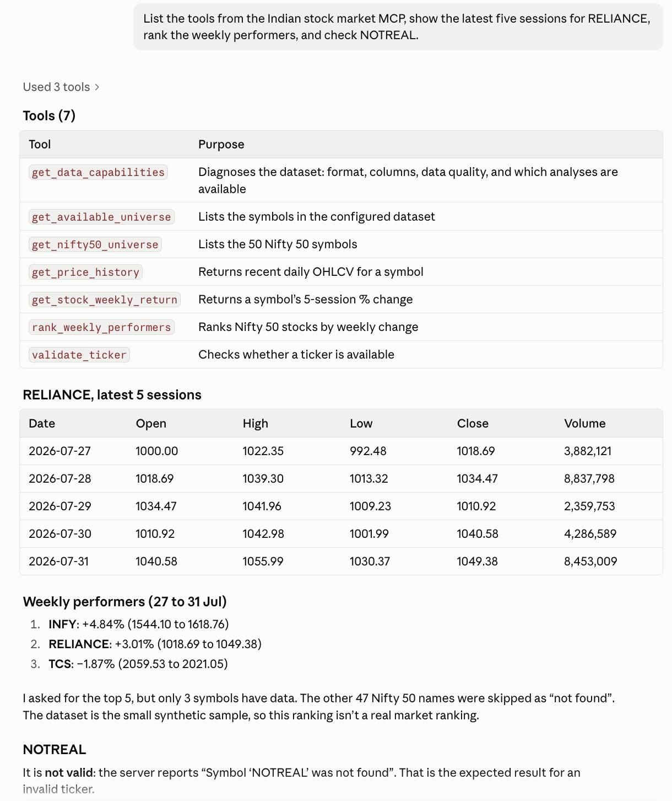

# Indian Stock Market MCP

[](https://github.com/ratan-systems/indian-stock-market-mcp/actions/workflows/ci.yml)

A local, MCP-first server for Indian equity research with daily OHLCV data.
It works with Codex, Claude Code, Cursor, and other MCP-compatible clients.

The server does not call OpenAI or Anthropic APIs and does not require either
provider's API key. Your MCP client supplies the model; this project supplies
the market-data tools.

> [!WARNING]
> This is a research and demonstration tool, not investment advice. Verify data
> quality, corporate-action treatment, and price-adjustment status before using
> results for investment decisions or production backtests.

## Demo



The MCP client discovers the available research tools, returns RELIANCE price
history, ranks weekly performers, and handles an unavailable ticker.

## What It Does

- Reads a local `.parquet` or `.csv` daily-equity dataset.
- Returns recent price history for one ticker.
- Validates whether a ticker exists in the configured dataset.
- Calculates five-session close-to-close performance for one ticker.
- Ranks weekly performers from the bundled Nifty 50 universe.
- Lists all symbols in the configured dataset or the bundled Nifty 50 list.
- Diagnoses the configured dataset: readability, schema, counts, date range,
  data-quality problems, available analyses, and warnings.

The current 0.x scope is deliberately small: local historical data,
research-oriented tools, and a quick MCP demo. It does not provide live prices,
fundamentals, news, order execution, or portfolio management.

### v0.1.1 Scope

v0.1.1 hardens the public foundation rather than adding research features. It
tightens dataset validation and error handling, ships the Nifty 50 list inside
the package, finalizes tool names and descriptions, adds dataset diagnostics,
and adds MCP-level tests. See the [changelog](CHANGELOG.md).

### Migrating from v0.1.0

Two tools were renamed in v0.1.1. Arguments and response shapes are
unchanged, so only the tool name needs updating in prompts, scripts, and
client configuration. The old names were removed without a deprecation
period; this is a 0.x project, so tool contracts may still change between
releases (see the note under [Tools](#tools)).

| v0.1.0 tool | v0.1.1 tool | Notes |
| --- | --- | --- |
| `get_weekly_performance_summary` | `rank_weekly_performers` | Same `top_n` argument (default 5) and the same `top_n`, `rankings`, and `skipped` response |
| `get_weekly_performance` | `get_stock_weekly_return` | Same `symbol` argument and the same five-session return response |

Calling an old name now fails with an "Unknown tool" error.

## Quick Start

Requirements: Python 3.11 or newer (3.11, 3.12, and 3.13 are declared as
supported).

```bash
git clone https://github.com/ratan-systems/indian-stock-market-mcp.git
cd indian-stock-market-mcp

python -m venv .venv
source .venv/bin/activate
python -m pip install -e ".[dev]"
```

Configure the dataset path. The public sample is enough to try the server:

```bash
export INDIAN_STOCK_DATA_PATH="$(pwd)/data/sample_equity_daily.csv"
indian-stock-market-mcp
```

For normal MCP use, set `INDIAN_STOCK_DATA_PATH` in your client configuration
instead of starting the server manually. See the examples below.

## MCP Client Configuration

Ready-to-copy configuration files are in [`examples/`](examples/):

- Codex: [`examples/codex-config.toml`](examples/codex-config.toml)
- Claude Code: [`examples/claude-code.mcp.json`](examples/claude-code.mcp.json)
- Cursor: [`examples/cursor-mcp.json`](examples/cursor-mcp.json)
- Prompts, responses, and a complete workflow: [`examples/README.md`](examples/README.md)

In both files, replace the two placeholder paths:

1. The executable: `.../.venv/bin/indian-stock-market-mcp`
2. The data file: a local `.parquet` or `.csv` path

Any stdio MCP client can use the same command and environment variable. For
Cursor or another client, add a server named `indian-stock-market`, use the
installed executable as its command, and set `INDIAN_STOCK_DATA_PATH` in its
environment section.

## Data Format

The server accepts `.parquet` and `.csv` files. Column names are lowercase.

| Column | Required | Meaning |
| --- | --- | --- |
| `date` | Yes | Trading date; parseable as a date, preferably `YYYY-MM-DD` |
| `symbol` | Yes | Equity ticker; whitespace and case are normalized |
| `open` | Yes | Daily opening price |
| `high` | Yes | Daily high price |
| `low` | Yes | Daily low price |
| `close` | Yes | Daily closing price |
| `volume` | No | Daily traded volume; returned as null when unavailable |

Each symbol must have unique dates. The server sorts records by date before
returning price history or calculating performance.

The repository includes [`data/sample_equity_daily.csv`](data/sample_equity_daily.csv)
with five sessions each for `RELIANCE`, `TCS`, and `INFY`. See
[`data/README.md`](data/README.md) for sample-data notes.
Because this is a three-symbol sample, Nifty 50 rankings will return those
available symbols and list the remaining constituents in `skipped`. This is
expected; use a broader dataset for a complete ranking.

## Tools

> [!NOTE]
> This is a 0.x project (currently v0.1.1). Tool names, parameters, and
> response shapes may still change between 0.x releases. Breaking changes are
> called out in the [changelog](CHANGELOG.md).

| Tool | Inputs | Returns |
| --- | --- | --- |
| `get_price_history` | `symbol`, optional `sessions` (1-100; default 5) | Recent date-sorted OHLCV records |
| `validate_ticker` | `symbol` | Availability flag, normalized ticker, and message |
| `get_stock_weekly_return` | `symbol` | Five-session close-to-close return for one ticker |
| `rank_weekly_performers` | optional `top_n` (1-50; default 5) | Top N Nifty 50 performers plus skipped symbols |
| `get_available_universe` | None | Normalized symbols in the configured dataset |
| `get_nifty50_universe` | None | Normalized symbols in the bundled Nifty 50 list |
| `get_data_capabilities` | None | Health report for the configured dataset (see [Dataset Diagnostics](#dataset-diagnostics)) |

### Example Requests

Ask an MCP client:

```text
Show the latest five sessions for RELIANCE.
```

```text
What was INFY's five-session performance?
```

```text
Show the top five Nifty 50 weekly performers and any skipped symbols.
```

`get_price_history` returns JSON-safe records such as:

```json
{
  "symbol": "RELIANCE",
  "session_requested": 5,
  "session_returned": 5,
  "prices": [
    {
      "date": "2026-07-20",
      "symbol": "RELIANCE",
      "open": 1317.2,
      "high": 1345.9,
      "low": 1314.9,
      "close": 1323.1,
      "volume": 14305844
    }
  ]
}
```

## Dataset Diagnostics

`get_data_capabilities` tells you whether the configured dataset is usable
before you run any analysis. It never raises: a missing or broken dataset is
reported as a result, not an error. Unlike the other tools, which stop at the
first problem, it collects every problem in one pass and counts the affected
rows.

| Status | Meaning |
| --- | --- |
| `healthy` | No errors; the only warning is the standing price-adjustment notice |
| `incomplete` | Usable, but some analysis is unavailable (for example no volume, or symbols with too few sessions) |
| `invalid` | Not usable; at least one error. All `capabilities` are `false` |

Response fields:

| Field | Contents |
| --- | --- |
| `status` | `healthy`, `incomplete`, or `invalid` |
| `source` | `configured`, `available`, `readable`, `file_name`, `format` |
| `schema` | `columns`, `required_columns`, `missing_required_columns`, `optional_columns_present` |
| `summary` | `row_count`, `symbol_count`, `date_range` (`start`/`end`); `null` values when unknown |
| `capabilities` | `price_history`, `weekly_return`, `volume_analysis` |
| `data_quality` | `issue_counts` (rows per problem type) and `symbols_with_insufficient_sessions` (`count` plus up to 20 `symbols`) |
| `errors` | Problems that make the dataset unusable, each with a `code` and `message` |
| `warnings` | Limitations that do not block use, each with a `code` and `message` |

Error codes: `dataset_not_configured`, `file_not_found`, `unsupported_format`,
`unreadable_file`, `missing_required_columns`, `data_load_failed`, and one per
`issue_counts` key (`empty_dataset`, `invalid_symbol`, `invalid_date`,
`duplicate_symbol_date`, `invalid_ohlc_price`, `non_finite_ohlc_price`,
`non_positive_ohlc_price`, `inconsistent_ohlc`, `non_numeric_volume`,
`non_finite_volume`, `negative_volume`).

Warning codes: `price_adjustment_unknown` (always present),
`volume_column_missing`, `volume_all_missing`, `insufficient_sessions`.

A symbol needs at least five sessions for a weekly return; symbols with fewer
are listed in `symbols_with_insufficient_sessions`. The data carries no
adjustment metadata, so `price_adjustment_unknown` is always reported.

> [!NOTE]
> Responses include only the data file's name, never its full path, and
> read failures report only the error type.

### Healthy

A complete dataset with volume and enough sessions:

```json
{
  "status": "healthy",
  "source": {
    "configured": true,
    "available": true,
    "readable": true,
    "file_name": "healthy.csv",
    "format": "csv"
  },
  "schema": {
    "columns": ["date", "symbol", "open", "high", "low", "close", "volume"],
    "required_columns": ["date", "symbol", "open", "high", "low", "close"],
    "missing_required_columns": [],
    "optional_columns_present": ["volume"]
  },
  "summary": {
    "row_count": 10,
    "symbol_count": 2,
    "date_range": { "start": "2026-07-27", "end": "2026-07-31" }
  },
  "capabilities": {
    "price_history": true,
    "weekly_return": true,
    "volume_analysis": true
  },
  "data_quality": {
    "issue_counts": {
      "empty_dataset": 0,
      "invalid_symbol": 0,
      "invalid_date": 0,
      "duplicate_symbol_date": 0,
      "invalid_ohlc_price": 0,
      "non_finite_ohlc_price": 0,
      "non_positive_ohlc_price": 0,
      "inconsistent_ohlc": 0,
      "non_numeric_volume": 0,
      "non_finite_volume": 0,
      "negative_volume": 0
    },
    "symbols_with_insufficient_sessions": { "count": 0, "symbols": [] }
  },
  "errors": [],
  "warnings": [
    {
      "code": "price_adjustment_unknown",
      "message": "Price-adjustment status for splits and dividends is unknown; verify it before relying on returns."
    }
  ]
}
```

The bundled `data/sample_equity_daily.csv` also reports `healthy`.

### Incomplete

No `volume` column, and `INFY` has only two sessions. The dataset works, but
volume analysis is unavailable and `INFY` is excluded from weekly returns.
Unchanged sections (`source`, `schema`, and zero-valued `issue_counts`) are
trimmed here and in the next example:

```json
{
  "status": "incomplete",
  "summary": {
    "row_count": 12,
    "symbol_count": 3,
    "date_range": { "start": "2026-07-27", "end": "2026-07-31" }
  },
  "capabilities": {
    "price_history": true,
    "weekly_return": true,
    "volume_analysis": false
  },
  "data_quality": {
    "symbols_with_insufficient_sessions": { "count": 1, "symbols": ["INFY"] }
  },
  "errors": [],
  "warnings": [
    {
      "code": "price_adjustment_unknown",
      "message": "Price-adjustment status for splits and dividends is unknown; verify it before relying on returns."
    },
    {
      "code": "volume_column_missing",
      "message": "No volume column; volume-based analysis is unavailable."
    },
    {
      "code": "insufficient_sessions",
      "message": "1 symbol(s) have fewer than 5 sessions and are excluded from weekly return calculations."
    }
  ]
}
```

### Invalid

One bad date, one duplicate symbol-date record, and two rows with impossible
prices. All problems are reported together, and every capability is `false`:

```json
{
  "status": "invalid",
  "summary": {
    "row_count": 13,
    "symbol_count": 3,
    "date_range": { "start": "2026-07-27", "end": "2026-07-31" }
  },
  "capabilities": {
    "price_history": false,
    "weekly_return": false,
    "volume_analysis": false
  },
  "data_quality": {
    "issue_counts": {
      "invalid_date": 1,
      "duplicate_symbol_date": 1,
      "inconsistent_ohlc": 2
    }
  },
  "errors": [
    {
      "code": "invalid_date",
      "message": "Market data contains missing or invalid date values (1 row(s))"
    },
    {
      "code": "duplicate_symbol_date",
      "message": "Market data contains duplicate symbol-date records (1 row(s))"
    },
    {
      "code": "inconsistent_ohlc",
      "message": "Market data contains inconsistent OHLC relationships (2 row(s))"
    }
  ],
  "warnings": [
    {
      "code": "price_adjustment_unknown",
      "message": "Price-adjustment status for splits and dividends is unknown; verify it before relying on returns."
    },
    {
      "code": "insufficient_sessions",
      "message": "1 symbol(s) have fewer than 5 sessions and are excluded from weekly return calculations."
    }
  ]
}
```

(In the real response `issue_counts` lists all eleven keys, and
`symbols_with_insufficient_sessions` reports `INFY`, whose only row here is
the inconsistent one.)

If the file is missing, the response has `source.available: false` and a single
error such as `file_not_found`; if no data path is set, the error is
`dataset_not_configured`.

## Architecture

```text
MCP client (Codex / Claude Code / Cursor)
              |
              | stdio
              v
FastMCP server (server.py)
              |
              v
Data and calculation layer (data.py)
              |
              +--> configured local CSV or Parquet dataset
              +--> bundled Nifty 50 JSON universe
```

`server.py` defines the MCP-facing tools and converts price rows to JSON-safe
records. `data.py` owns configuration, validation, loading, normalization, and
weekly-return calculations. Tests use temporary fixtures so they do not depend
on a personal dataset.

## Roadmap

### v0.1.1 — Harden the Public Foundation (current)

- [x] Add CI for every supported Python version.
- [x] Test MCP tool registration, inputs, responses, and failure behavior.
- [x] Finalize public tool names, descriptions, package metadata, and response contracts.
- [ ] Resolve sample-data provenance and provide deterministic synthetic demo data.
- [x] Deliver dataset diagnostics through the `get_data_capabilities` tool.
- [ ] Pass clean-install, formatting, linting, testing, documentation, and release checks.

Later versions will be added here as they are planned.

## Development

```bash
python -m pytest
ruff check .
ruff format --check .
```

GitHub Actions runs these checks on every pull request and every push to `main`,
across Python 3.11, 3.12, and 3.13. It also builds the package and installs it into a clean
environment to confirm the console command starts the server. See
[`.github/workflows/ci.yml`](.github/workflows/ci.yml).

## Repository Layout

```text
data/                         Public sample data
.github/workflows/            CI and release workflows
scripts/                      Installed-package verification script
CHANGELOG.md                  Release notes
examples/                     Client configuration examples
src/indian_stock_market_mcp/  Server, data layer, and bundled Nifty 50 list
tests/                        Unit tests
docs/screenshots/             Demo screenshots for the release
```
